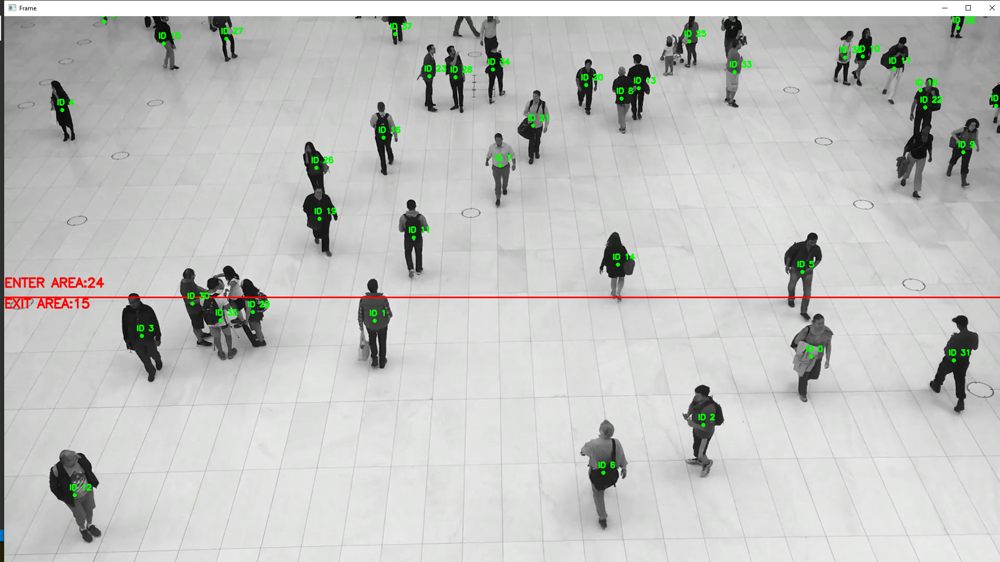

# Team Samurai Hawks
## Face Recognition logger
#
# People counter improved version
## Current implementation utilizes the yolov5 pretrained deep learning model for detecting the people in a image. All the detected persons are then tracked and counted based on centroid tracker implementation. Results recieved from the centroid tracker are interpreted as a number of people that have entered in the building or exited the building. Note that this scenario is only adapted to the camera angle that is used in people_demo.mp4 all other camera angles will give an incorrect results.

#
# How to run the example
## pip install ./requirements.txt
## python .\count_people.py '.\people demo.mp4'

